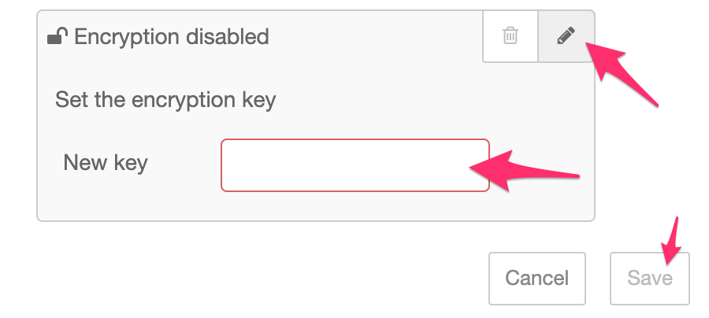

*Quick links :*
[Home](/README.md) - [**Part 1**](../part1/README.md) - [Part 2](../part2/README.md) - [Part 3](../part3/README.md) - [Part 4](../part4/README.md) - [Part 5](../part5/README.md)
***

# Part 1: Getting Started with Node-RED

**Goal:** *Get a Node-RED application running locally against a CouchDB database*

## Introduction

This section of the workshop gets you started with an existing [Node-RED project](https://github.com/knolleary/node-red-todo-app)
that provides a simple To-Do list. It is based on the [TodoMVC](http://todomvc.com/)
and [Todo-Backend](https://www.todobackend.com/) projects.

The Node-RED flows implement the backend REST API used by the Todo web app and
store the application data in a CouchDB database.

Rather than build the application from scratch, an example Node-RED project is
provided as the starting point.

## Steps

 - [1 - Install Node-RED](#11---install-node-red)
 - [2 - Install CouchDB](#12---install-couchdb)
 - [3 - Configure CouchDB](#13---configure-couchdb)
 - [4 - Configure Node-RED](#14---configure-node-red)
 - [5 - Clone the Node-RED Project](#15---clone-the-node-red-project)

## 1.1 - Install Node-RED

Node-RED can be installed by running:

    npm install -g --unsafe-perm node-red

Once installed, it can be started by using the command `node-red`.

The log output will look similar to:

```
$ node-red

Welcome to Node-RED
===================

11 Oct 23:43:39 - [info] Node-RED version: v1.0.2
11 Oct 23:43:39 - [info] Node.js  version: v10.16.3
11 Oct 23:43:39 - [info] Darwin 18.7.0 x64 LE
11 Oct 23:43:39 - [info] Loading palette nodes
11 Oct 23:43:44 - [info] Settings file  : /Users/nol/.node-red/settings.js
11 Oct 23:43:44 - [info] User directory : /Users/nol/.node-red
11 Oct 23:43:44 - [warn] Projects disabled : set editorTheme.projects.enabled=true to enable
11 Oct 23:43:44 - [info] Creating new flows file : flows_noltop.json
11 Oct 23:43:44 - [info] Starting flows
11 Oct 23:43:44 - [info] Started flows
11 Oct 23:43:44 - [info] Server now running at http://127.0.0.1:1880/
```

Two things to make a note of from this output:
 - the **settings file** location, typically `~/.node-red/settings.js`
 - the **user directory** location, typically `~/.node-red`

You will need to refer back to these locations through-out this workshop.

Once running, you can open the url it provides in your web browser to access the
Node-RED editor.

## 1.2 - Install CouchDB

The example application provided by this workshop uses CouchDB to store its data.
Eventually we will configure the application to use a cloud-hosted instance, but
to begin with it needs a local copy to work with.

#### Using Docker

If you have Docker installed, the easiest way to get a local CouchDB instance running
is to use their container. The following command will pull down the latest image
and run it locally, exposing it on port 5984.

```
docker run -p 5984:5984 -d --name node-red-couchdb couchdb:latest
```

#### Manual Install

The CouchDB project [provides downloads](https://couchdb.apache.org/) for a number
of platforms and a [comprehensive install guide](http://docs.couchdb.org/en/stable/install/index.html). Chose the option most appropriate for your own machine.

## 1.3 - Configure CouchDB

Once you have CouchDB running locally, you need to create a database for the application.

That can be done using the command:

```
curl -X PUT  http://localhost:5984/todos
```


## 1.4 - Configure Node-RED

For this workshop you need to modify some of the default runtime settings. These
are all in the **settings file**. (`~/.node-red/settings.js`).

1. Find the `httpAdminRoot` setting. This changes the path you access the
   Node-RED editor on. By default it uses the root path `/`, but we want to use
   that for our application, so we can use this setting to move the editor. It is
   commented out by default - uncomment it by removing the `//` at the start of
   the line:

        httpAdminRoot: '/admin',

   This will move the editor to `/admin`.

2. Find the `editorTheme` setting at the end of the file. Within that setting is
   the option to enable the "projects" feature. Set that to `true`.

        editorTheme: {
            projects: {
                enabled: true
            }
        }


Stop Node-RED running (`Ctrl-C` in the terminal you started it in) and restart it
to pick-up these changes.

Once restarted you will now access the editor at http://127.0.0.1:1880/admin/ where
it will prompt you to create your first project, which you will do in the next step.

## 1.5 - Clone the Node-RED Project

This workshop provides an example Node-RED project for you to use. This step shows
how to clone the project into your Node-RED instance.

1. Open the Node-RED editor - http://127.0.0.1:1880/admin/
2. Click the `Clone Repository` button in the Projects Welcome screen. If you've already
   closed that screen, you can reopen it with `Projects -> New` from the main menu.
3. Provide your username and email address - these are used when commiting changes
   to the project. If your local git client is already configured it will pick
   those values.
4. On the `Clone a project` screen paste in the following URL into the `Git repository URL`
   field:

         https://github.com/knolleary/node-red-todo-app.git

   Leave the `Credentials encryption key` field blank


This will clone the repository into a new local project and start it running.

In the workspace you can see flows that implement each part of the application's
REST API.

The project also includes some static resources that need to be served by the
runtime. To do that, another change is needed in your settings file.

1. First you must locate your newly-cloned project on the local filesystem. It
   will be in `<user-directory>/projects/<name-of-project>`. Within that folder
   you will find a folder called `public` - this contains the static resources
   for the project.

2. Edit your settings file (`~/.node-red/settings.js`) and find the `httpStatic`
   property. Uncomment it by removing the `//` at the start of the line and set
   its value to the **absolute path** to `public` folder. For example:

       httpStatic: "/User/nol/.node-red/projects/my-demo-project/public",

3. Restart Node-RED


If everything is working you should be able to open http://localhost:1880 and see
the application.

You can check it is working by adding some ToDo items and then reload the page
to check they were saved in CouchDB.

## 1.5 - Update project settings

The example project is configured to *not* encrypt its credentials file. This has
been done so that anyone is able to clone the project to get started. But it is
not a suitable configuration for a real project.

This step shows how to update the project to start encrypting its credentials.

1. In the Node-RED editor open the Project Settings dialog (`Projects -> Project Settings`)
   and switch to the Settings tab.

2. Click the `edit` button in the `Files` section and then click on the pencil
   button next to the Encryption field.

   

3. Enter a new encryption key and click Save. Make a note of the key as you will need it later on.

   

## Summary

In this section of the workshop you have:

 - Installed Node-RED
 - Installed CouchDB
 - Cloned an example application and got it working locally - well done!

## Next Steps

The next task to get this application running in the cloud. To do that, we must
first setup some cloud resources in [Part 2](../part2/README.md).


***
*Quick links :*
[Home](/README.md) - [**Part 1**](../part1/README.md) - [Part 2](../part2/README.md) - [Part 3](../part3/README.md) - [Part 4](../part4/README.md) - [Part 5](../part5/README.md)
