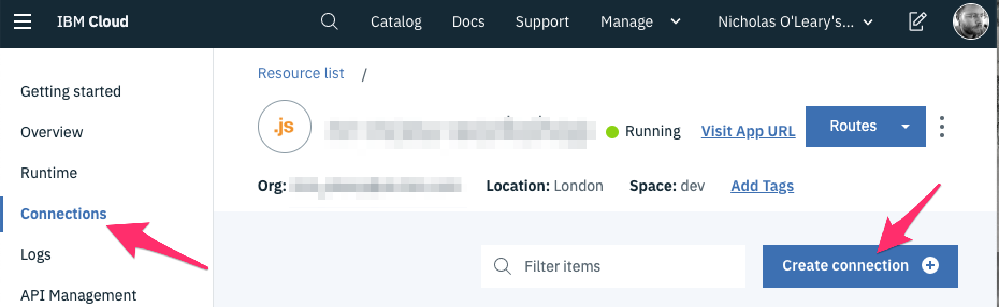
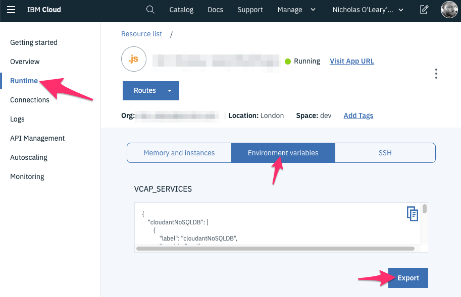

*Quick links :*
[Home](/README.md) - [Part 1](../part1/README.md) - [Part 2](../part2/README.md) - [Part 3](../part3/README.md) - [**Part 4**](../part4/README.md) - [Part 5](../part5/README.md)
***

# Part 4: Connect your application to a cloud-hosted database

**Goal:** *Create a cloud-hosted Cloudant instance and configure the application to use it with separate development and production databases*

## Introduction

This section updates the application to use a cloud-hosted database.

For simplicity it uses the same service for both 'development' and 'production'
but uses different databases within it.

This demonstrates how environment variables can be used to run the same Node-RED
application in different environments without having to edit the flows to change
what they connect to.

## Steps

 - [1 - Create a Cloudant Lite plan instance](#41---create-a-cloudant-lite-plan-instance)
 - [2 - Bind the Cloudant service to your application](#42---bind-the-cloudant-service-to-your-application)
 - [3 - Download the VCAP_SERVICES file](#43---download-the-vcapservices-file)
 - [4 - Use the credentials locally](#44---use-the-credentials-locally)
 - [5 - Update the flows to use the Cloudant service](#45---update-the-flows-to-use-the-cloudant-service)
 - [6 - Deploy the updates to IBM Cloud](#46---deploy-the-updates-to-ibm-cloud)


## 4.1 - Create a Cloudant Lite plan instance

To replace the local CouchDB instance, we are going to use the Cloudant service -
a managed database service that is based on CouchDB.

1. Open the [IBM Cloud catalog](https://cloud.ibm.com/catalog) then search for and
   select `cloudant`

2. Create an instance of the service with the following options:
    - Pick the same region you deployed your application to. (`us-south` is `Dallas`, `eu-gb` is `London`)
    - Ensure the `Lite` plan is selected
    - Leave the `Service name`, `resource group` and `Tags` as their defaults
    - Select `Use both legacy credentials and IAM` for the authentication method

3. Once created it will redirect you back to your Resource list. Find your newly
   created instance in the `Services` section of the list. Once it is listed as "Provisioned" (you may need to refresh the page) click on its entry to see its
   details.

4. From the details page, click the `Launch Cloudant Dashboard` button to open
   the dashboard in a new browser tab.

5. On the dashboard, click the `Create Database` button in the header. Create a "non-partitioned" database called `todos`.

6. Create a second database called `todos_dev`.

Leave the Cloudant dashboard open in your browser as you will need to come back
to it later on.


## 4.2 - Bind the Cloudant service to your application


The next step is to connect your new Cloudant instance to your application. This
will cause the platform to generate a set of credentials for your application to use.

1. Open the [IBM Cloud resource list](https://cloud.ibm.com/resources) and click
   on the entry for your application under the `Cloud Foundry Apps` section.

2. In the left-hand sidebar, open the `Connections` section and then `Create connection`.

    

3. This will show a list of your services that can be connected. Find your
   Cloudant instance and click the `Connect` button that appears when you
   hover over it. Accept the default settings and click `Connect`.

4. Once it has connected, it will ask if you want to Restage the application. Click
   `Restage`.


## 4.3 - Download the VCAP_SERVICES file

The credentials generated for your application are provided by an environment
variable called `VCAP_SERVICES`. The Cloudant nodes in Node-RED know how to use
that variable to get their connection details. You will be updating the flow to
make use of that in a later step.

First we need to make the credentials available to your local Node-RED installation.

1. Click on the `Runtime` section of your application's dashboard page, and then
   on the `Environment variables` section.

2. You will see the value of the `VCAP_SERVICES` variable. Click on the `Export`
   button. This will download a `.json` file containing the credentials.

    


3. Move this file to your Node-RED user directory - `~/.node-red/`.


## 4.4 - Use the credentials locally

To use the credentials locally, you need to expose them in the same way as they
are exposed in the cloud - by setting the `VCAP_SERVICES` environment variable.

1. Edit your main Node-RED `settings.js` file (`/.node-red/settings.js`).

2. Near the top you should see a commented-out line that loads the `fs` module. Uncomment
   that line and add the following (make sure you replace the name of the vcap services
   file you downloaded in the previous step).

   ```
   var fs = require("fs");
   var path = require("path");
   // Load and export the credentials
   process.env.VCAP_SERVICES = fs.readFileSync(path.join(__dirname,"your-vcap-services-file.json"));
   ```


As we want our local Node-RED instance to use a *different* database to our
cloud-hosted production system, we are going to use another environment variable
to control this.

Add the following to the settings file below the `VCAP_SERVICES` lines:

```
// Set the database name for local development
process.env.TODO_DATABASE = "todos_dev";
```

Note this matches the name of one of the databases created in step 4.1.

Restart Node-RED locally to pickup these changes.

## 4.5 - Update the flows to use the Cloudant service

The next task is to update all of the CouchDB nodes in the flows to use the cloud-hosted
service rather than directly connect to the local CouchDB instance.


1. Open the editor at http://localhost:1880/admin

2. Edit the 'Get all' cloudant node in the first flow by double-clicking on it.

3. Change the 'Service' field to the name of your Cloudant service instance. If it
   doesn't list your service instance something has gone wrong with setting up
   the VCAP_SERVICES environment variable in the previous step. Go back and double
   check you've done it correctly.

4. Change the 'Database' field to `${TODO_DATABASE}`. This is a special syntax that
   Node-RED supports that will cause the runtime to substitute the corresponding
   environment variable into this field when it creates the node.

5. Confirm the changes by clicking the 'Done' button and proceed to change all
   of the remaining blue Cloudant nodes in exactly the same way. There are eight (8)
   in total to update.

6. Once all of the nodes have been updated, click the Deploy button.

7. Open up the application in a new window - http://localhost:1880 - and create
   some new todo items. Go back to the Cloudant dashboard page you left open
   in the early step and refresh the page. You should see the document count for
   the `todos_dev` database has gone up. If not, check the Node-RED log output
   for any errors.


## 4.5 - Update application settings file

One final update is needed to configure the cloud-deployed version of the application
to use its own database - `todos`.

You can either:

- use the `ibmcloud cf set-env` command to set the `TODO_DATABASE` environment variable
   to `todos`, in the same way you set `NODE_RED_CREDENTIAL_SECRET` in step 3.4

- or, add the line `process.env.TODO_DATABASE = 'todos';` to your project's `settings.js` file. (`~/.node-red/projects/<name-of-project>/settings.js`).

## 4.6 - Deploy the updates to IBM Cloud

Once all of these changes have been made, you can deploy the updates to the cloud
in the same way you did in part 3.4:

Open a terminal and change to the project directory - `~/.node-red/projects/<name-of-project>`.
Then run the command:

    ibmcloud cf push


Once that completes, you should be able to access your application using the URL
provided. You can add todo items and refresh the page to see they have been saved.

Go back to the Cloudant dashboard page and refresh it. You should now see the
document count for the `todos` database has gone up.


## Summary

In this section of the workshop you have done a lot. Well done.

More specifically, you have:

 - Created a cloud-hosted cloudant service, with database for your production and
   development environments
 - Configured your local development Node-RED to use the development database
 - Configured the deployed Node-RED to use the production database

## Next Steps

If you have got this far, then you have a setup where you can develop an application
locally and then manually deploy changes to your production cloud environment.

The next task is to automate the deployment of changes whenever you commit changes
to a git repo. [Part 5](../part5/README.md) unlocks the secrets of doing just that.

***
*Quick links :*
[Home](/README.md) - [Part 1](../part1/README.md) - [Part 2](../part2/README.md) - [Part 3](../part3/README.md) - [**Part 4**](../part4/README.md) - [Part 5](../part5/README.md)
