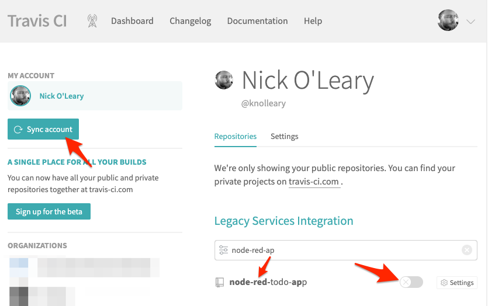
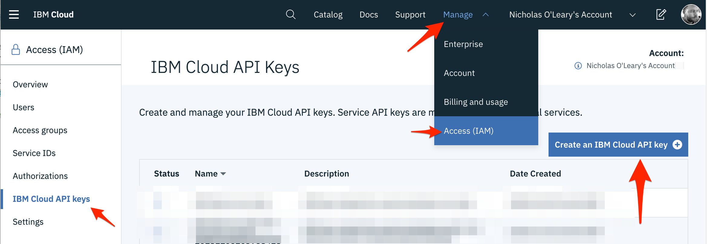
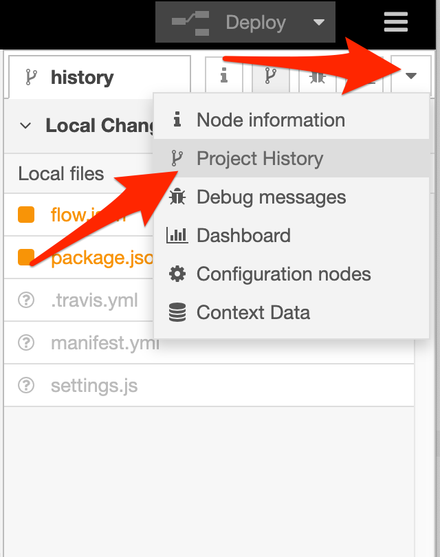
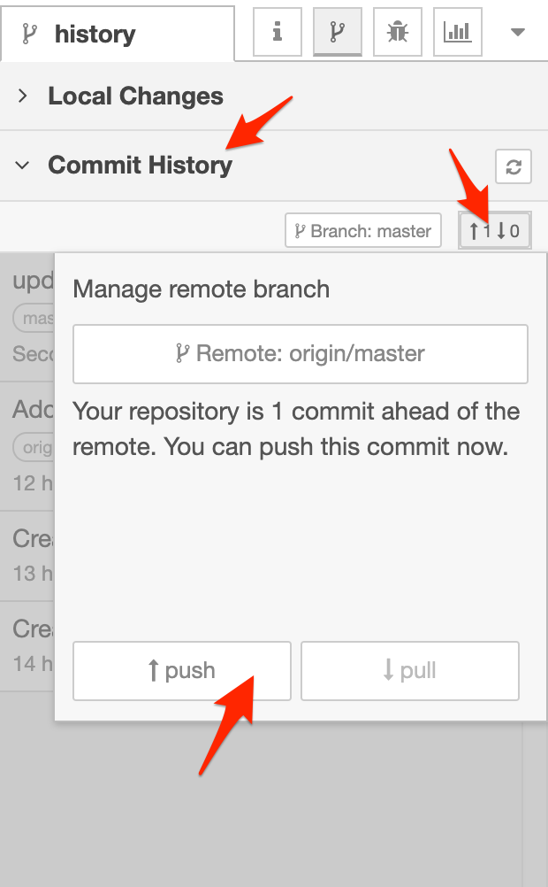

*Quick links :*
[Home](/README.md) - [Part 1](../part1/README.md) - [Part 2](../part2/README.md) - [Part 3](../part3/README.md) - [Part 4](../part4/README.md) - [**Part 5**](../part5/README.md)
***

# Part 5: Setup a deployment pipeline to IBM Cloud

**Goal:** *Create a deployment pipeline use TravisCI to automatically deploy your application when pushing updates to a GitHub repository*

## Introduction

The final part of this workshop looks at how you can automate the workflow of
getting changes to your flows in Node-RED automatically deployed to IBM Cloud.


## Steps

 - [1 - Setup Travis](#51---setup-travis)
 - [2 - Install Travis CLI](#52---install-travis-cli)
 - [3 - Add .travis.yml file](#53---add-travisyml-file)
 - [4 - Generate IBM Cloud API key](#54---generate-ibm-cloud-api-key)
 - [5 - Encrypt api key](#55---encrypt-api-key)
 - [6 - Commit changes](#56---commit-changes)
 - [7 - Push changes to remote](#57---push-changes-to-remote)
 - [8 - Watch the build on Travis](#58---watch-the-build-on-travis)

## 5.1 - Setup Travis

The first step is to get Travis to watch your GitHub repository to trigger a build whenever
changes are pushed to it.

1. Sign into [Travis](https://travis-ci.org/) and connect it to your GitHub account.

2. Go to your [profile page](https://travis-ci.org/account/repositories) and enable
Travis for your repository. You may have to click 'Sync account' button for it to show up.

   

## 5.2 - Install Travis CLI

For Travis to be able to deploy to your IBM Cloud account it needs an access key.

You'll generate the key in a later step, but first you need to install the
[Travis CLI](https://github.com/travis-ci/travis.rb#the-travis-client-) that can
be used to securely encrypt the key.

They provide full [installation instructions](https://github.com/travis-ci/travis.rb#installation)
to follow, but if you have an up to date `ruby` environment on your machine, you
should be able to run:

    gem install travis


## 5.3 - Add .travis.yml file

The project needs a file called `.travis.yml` to tell Travis what to do when it
runs a build. A build consists of three phases: `install`, `script` and `deploy`.

For the purposes of this exercise, we’re going to skip the `install` and `script`
phases - they could be used in the future to run automated tests against the application.

For the `deploy` phase we can use an integration Travis already has with IBM Cloud - albeit under the old brand name: [`Bluemix CloudFoundry`](https://docs.travis-ci.com/user/deployment/bluemixcloudfoundry/).

Create the file `~/.node-red/projects/<name-of-project>/.travis.yml` with the following
contents:

```
language: node_js
node_js:
    - "node"
install: true
script: echo "Skipping build"
deploy:
  edge: true
  provider: bluemixcloudfoundry
  username: apikey
  organization: nick_oleary@uk.ibm.com
  space: dev
  manifest: manifest.yml
```

You will need to replace the `organization` and `space` fields to match your
own IBM Cloud account details. You can find these values by running `ibmcloud cf target`.

The `username` field *must* be left as `apikey` and the next step will generate
the key for it to use.


## 5.4 - Generate IBM Cloud API key

You need to generate an API key in your IBM Cloud account for Travis to use to
deploy your application.

1. Log in to the [IBM Cloud](https://cloud.ibm.com/) and select `Manage -> Access -> IBM Cloud API Keys` from the menu in the header. Then click the 'Create' button.

  

2. Enter a sensible name for the key and click Create. The key will be generated
and in the next dialog it will let you copy it to your clipboard. Make sure you
copy it - once you close the dialog you will not be able to see it again and
you’ll need to generate a new one.


## 5.5 - Encrypt api key

In the same folder as your `.travis.yml` file (`~/.node-red/projects/<name-of-project>/`),
run the command:

    travis encrypt --add deploy.password

This will prompt you to paste in the API key you generated in the previous step.
After pasting it in, hit `enter` and then `ctrl-d`.

Your `.travis.yml` file should have been updated with a new `password/secure` section
under the `deploy` section.


## 5.6 - Commit changes

At this point you will have a lot of uncommitted changes to the project files.

The next task is to commit those changes and push them back to your remote repository.

1. Open the Node-RED editor and open the `Project History` sidebar. This provides
   a view of the changes made to files in the project. You may need to click the
   refresh button to update the view.

    

2. Click the `+ all` button to move all of the files to the 'Changes to commit'
   section.

3. Click the `commit` button, enter a commit message and confirm.

## 5.7 - Push changes to remote

With the changes committed locally, the next task is to push them back to your
GitHub repository.

1. Switch to the `Commit History` section and you'll see the commits listed.

2. Click the `remote` button - the one with the up/down arrows - and click `push`.
   This will push the changes to GitHub. Node-RED will prompt you for your GitHub
   credentials - remember to use the access token you created long ago in Part 1.6.


   

   If you hit an authentication error, restart Node-RED to flush its credential
   cache and try again. If a problem persists, you may need to drop to the command-line
   to manually run a `git push` in the project's folder.


## 5.8 - Watch the build on Travis

You should now be able to switch back to the Travis dashboard and see a new build
get triggered from your repository.

Watch the logs to see how it progresses and, all being well, it should successfully
deploy your application to IBM Cloud.


## Summary

In this final section of the workshop you have created a deployment pipeline that
allows you to develop an application locally in Node-RED, commit and push changes
to GitHub and have them automatically deploy to IBM Cloud.

## Next Steps

Marvel at what you have achieved.

You've seen how environment variables can be used to customise the flow
configuration for different environments. Think about how else that could be used.

Whilst this workshop has used IBM Cloud, GitHub and Travis CI as a particular
set of technologies, the underlying principles are not tied to any one of those.

Investing a bit of time setting up a proper development workflow for whatever
environment you want to use can provide huge benefits.


***
*Quick links :*
[Home](/README.md) - [Part 1](../part1/README.md) - [Part 2](../part2/README.md) - [Part 3](../part3/README.md) - [Part 4](../part4/README.md) - [**Part 5**](../part5/README.md)
